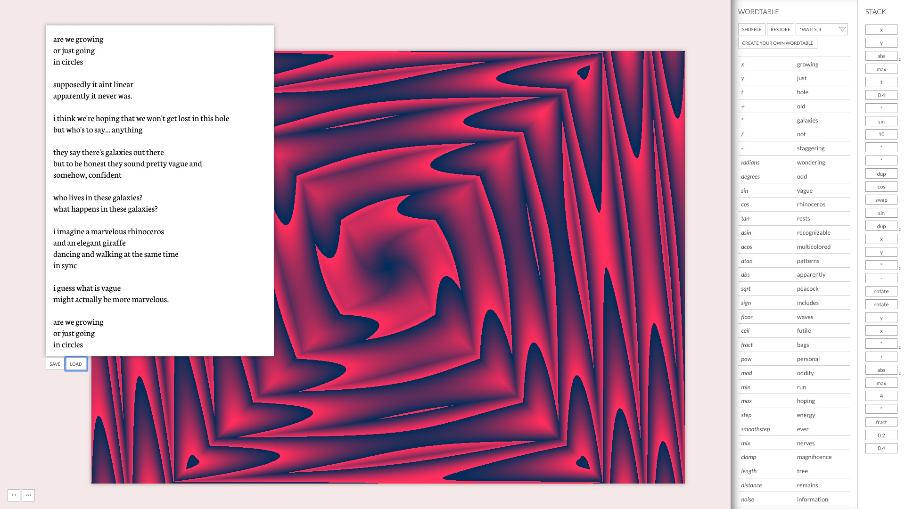

# in:verse

*in:verse* is an esoteric programming language and live-coding development environment. The language uses a stack based paradigm (inspired by Forth) and compiles to GLSL, or more specifically, a fragment shader on a plane. The language does not have a pre-determined vocabulary &mdash; rather, this is up to you.

A very rough and incomplete guide lives [here](guide.md). This will soon be updated with more details, and a few tutorials will follow too. A gallery of work created with *in:verse* lives [here](https://gallery.inverse.website).

### todos
* add functionality for:
  - [ ] publish to gallery
  - [ ] publish to twitter
  - [ ] forking
  - [ ] supporting different languages / scripts
  - [ ] additional stack manipulation functions
  - [ ] additional GLSL functions (dot, normal etc)
  - [ ] higher level functions (voronoi, tiling etc)
  - [ ] images / videos / camera feed as textures
* think about:
  - [ ] uploading text to extract wordtables
  - [ ] persisting user contributions to wordtables
  - [ ] persisting user contributions to stacks
  - [ ] collaborative live-coding

### inspiration
* [Chef](https://esolangs.org/wiki/Chef) - an esoteric language by David Morgan-Mar
* [Shakespeare](https://esolangs.org/wiki/Shakespeare) - an esoteric language by Karl Hasselström and Jon Åslund
* [Shaderforth](https://github.com/daeken/Shaderforth) - A shader language inspired by Forth, by Cody Brocious
* [esoteric.codes](https://esoteric.codes/) - a blog/website dedicated to esolangs, created by Daniel Temkin
